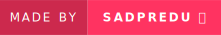
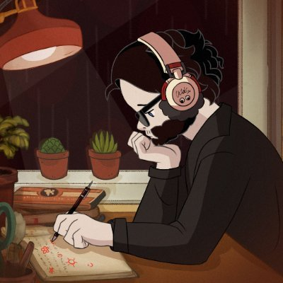

    
    

<!--  -->

 

  

 
 

Im a Full Stack Developer with strong knowledge in Python and Javascript. I'm a self-taught programmer and I'm always looking to improve my skills. I also know very well Java in the spring framework, my favorite stack is React using NextJs and I'm also learning NodeJs.

- 🌱 I’m currently learning PyTorch, Kotlin and AngularJs;
- 📔 Working on my Virtual Portfolio;
- 📻 Check this amazing virtual [radio](www.plaza.one);

 
 
<h1>STACK</h1>

    
 
         |
         |
         |
         |
         |       
         |  
         |
         |
         |
           |
         |
         |
         |
         |
         |
         |
         |
         |
         |
    

 

#

 
 

# STATS | LANGUAGES <>
    
 

 

# Prefered Code Editors

<picture>
  <source media="(prefers-color-scheme: dark)" srcset="https://raw.githubusercontent.com/mari4souza/mari4souza/output/github-contribution-grid-snake-dark.svg">
  <source media="(prefers-color-scheme: light)" srcset="https://raw.githubusercontent.com/mari4souza/mari4souza/output/github-contribution-grid-snake.svg">
  
</picture>
  

