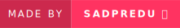
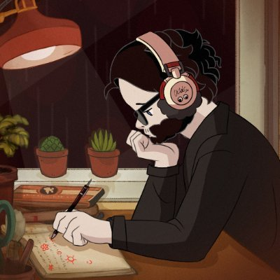

    
    

 

 

  
  
  

 

Im a Full Stack Developer with strong knowledge in Java and Javascript (React, NestJs). I'm a self-taught programmer and I'm always looking to improve my skills. I also know very well the spring framework, my favorite stack is React using NextJs and I'm also learning Love2D for my indie game project.

- 🌱 I’m currently working at Mutant/Vivo as a Tech Lead;
- 📔 Working on my Virtual [Portfolio](https://sad-portifolio.vercel.app);
- 📻 Check this amazing virtual [radio](https://plaza.one);

 
<h2 align="center">🚀 Minha Stack</h2>

  

        

 

# Some Stats
    
 

<table width="100%">
  <tr>
    <td width="50%">
      
    </td>
    <td width="50%">
      
    </td>
  </tr>
</table>

 

# Prefered Code Editors

  

